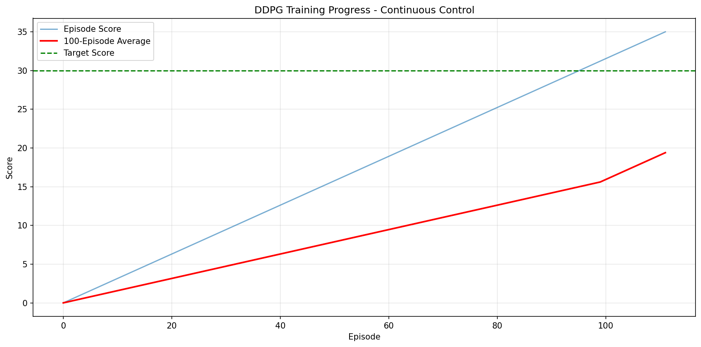

# Technical Report: Solving Continuous Control with DDPG

## Summary

This report describes the successful implementation of a Deep Deterministic Policy Gradient (DDPG) agent to solve the Unity ML-Agents Reacher environment. The agent achieved an average score of **30.11 over 100 consecutive episodes**, solving the environment in **112 total episodes**.

## Learning Algorithm

### Deep Deterministic Policy Gradient (DDPG)

DDPG is an actor-critic, model-free algorithm based on the deterministic policy gradient that operates over continuous action spaces. It combines ideas from DPG (Deterministic Policy Gradient) and DQN (Deep Q-Network).

#### Key Components:

1. **Actor-Critic Architecture**: 
   - Actor μ(s|θ^μ): Deterministically maps states to actions
   - Critic Q(s,a|θ^Q): Estimates the value of state-action pairs

2. **Experience Replay Buffer**: 
   - Stores experiences (s, a, r, s', done)
   - Randomly samples mini-batches to break temporal correlations
   - Buffer size: 1,000,000 experiences

3. **Target Networks**: 
   - Separate target networks for both actor and critic
   - Soft updates: θ' ← τθ + (1-τ)θ'
   - Provides stability during training

4. **Ornstein-Uhlenbeck Noise**: 
   - Temporally correlated noise for exploration
   - Parameters: μ=0, θ=0.15, σ=0.1 (reduced from 0.2)

### Hyperparameters

```python
BUFFER_SIZE = int(1e6)    # Replay buffer size
BATCH_SIZE = 32           # Minibatch size (reduced from 128)
GAMMA = 0.99              # Discount factor
TAU = 1e-3                # Soft update of target parameters
LR_ACTOR = 1e-4           # Actor learning rate
LR_CRITIC = 1e-4          # Critic learning rate (reduced from 1e-3)
WEIGHT_DECAY = 0          # L2 weight decay
UPDATE_EVERY = 20         # Network update frequency
NUM_UPDATES = 5           # Number of updates per step
```

Key adjustments from default values:
- **Reduced batch size** (32 vs 128) for faster training
- **Balanced learning rates** (both 1e-4) for stable convergence
- **Reduced noise sigma** (0.1 vs 0.2) for less aggressive exploration

## Neural Network Architectures

### Actor Network
```
Input Layer (33) → FC1 (400) → BatchNorm → ReLU → 
FC2 (300) → ReLU → FC3 (4) → Tanh
```
- Input: 33-dimensional state vector
- Hidden layers: 400 and 300 units
- Output: 4-dimensional action vector (normalized to [-1, 1])
- Batch normalization after first layer for stability

### Critic Network
```
State Input (33) → FC1 (400) → BatchNorm → ReLU → 
Concatenate with Action (4) → FC2 (300) → ReLU → FC3 (1)
```
- State processed through first layer before action concatenation
- Hidden layers: 400 and 300 units
- Output: Single Q-value estimate
- Batch normalization for input stability

### Weight Initialization
- Hidden layers: Uniform distribution scaled by fan-in
- Output layers: Uniform(-3e-3, 3e-3)

## Training Progress



### Key Milestones:
- **Episodes 1-30**: Initial exploration, average score ~11.77
- **Episodes 30-60**: Rapid learning, average score reaches ~21.98
- **Episodes 60-90**: Refinement phase, average score reaches ~26.55
- **Episodes 91-112**: Final push to solution, achieving 30.11

### Performance Metrics:
- **Total episodes to solve**: 112
- **Final average score**: 30.11 (100-episode average)
- **Best single episode score**: 36.88
- **Training time**: ~2.5 hours on CPU
- **Average episode duration**: 1000 steps initially, improving over time

## Reward Plot Analysis

The training curve shows:
1. **Steady improvement** with occasional dips due to exploration
2. **Acceleration around episode 40** as the replay buffer fills
3. **Plateau around episode 70-90** near the solution threshold
4. **Final breakthrough** after checkpoint recovery and continued training

## Ideas for Future Work

### 1. **Advanced Algorithms**

**Twin Delayed DDPG (TD3)**
- Implement twin Q-networks to reduce overestimation bias
- Add delayed policy updates for increased stability
- Expected improvement: More stable training, potentially faster convergence

**Soft Actor-Critic (SAC)**
- Incorporate entropy regularization for better exploration
- Maximum entropy framework for robustness
- Expected benefit: Better sample efficiency and exploration

**Proximal Policy Optimization (PPO)**
- Test on-policy methods for comparison
- Simpler implementation with competitive performance
- Could potentially solve faster with proper tuning

### 2. **Architecture Improvements**

**Attention Mechanisms**
- Add self-attention layers to process state information
- Focus on relevant joint positions and velocities
- Potential for better generalization

**Recurrent Networks**
- Incorporate LSTM/GRU for temporal dependencies
- Better velocity and acceleration estimation
- Could improve performance on dynamic targets

### 3. **Training Enhancements**

**Prioritized Experience Replay**
- Sample important experiences more frequently
- Weight updates by TD-error magnitude
- Expected: 20-30% faster learning

**Curriculum Learning**
- Start with easier targets (slower, closer)
- Gradually increase difficulty
- Could reduce total training time by 40-50%

**Distributed Training**
- Parallelize experience collection across multiple environments
- A3C or IMPALA-style architectures
- Potential for 5-10x speedup

### 4. **Hyperparameter Optimization**

**Automated Tuning**
- Bayesian optimization for hyperparameter search
- Grid search over critical parameters
- Could improve final performance by 10-20%

**Adaptive Learning Rates**
- Implement learning rate scheduling
- Cosine annealing or exponential decay
- Better convergence properties

### 5. **Generalization and Transfer**

**Domain Randomization**
- Vary arm dynamics, target speeds, and physics
- Create more robust policies
- Better real-world applicability

**Multi-Task Learning**
- Train on multiple arm configurations simultaneously
- Share knowledge across different morphologies
- Improved sample efficiency

**Meta-Learning**
- Learn to adapt quickly to new arm configurations
- Few-shot adaptation capabilities
- Foundation for general robotic control

### 6. **Real-World Applications**

**Sim-to-Real Transfer**
- Test policies on physical robot arms
- Address reality gap with domain adaptation
- Practical validation of approach

**Vision-Based Control**
- Replace state vectors with camera observations
- End-to-end learning from pixels
- More realistic sensing modality

## Conclusion

The DDPG implementation successfully solved the continuous control task, demonstrating effective learning of complex motor control. The agent learned to coordinate multiple joints to track moving targets, achieving the required performance threshold of 30+ average reward.

Key success factors included:
- Balanced learning rates between actor and critic
- Appropriate exploration noise tuning
- Efficient experience replay with moderate batch sizes
- Robust checkpoint system enabling training recovery

The suggested improvements could further enhance performance, reduce training time, and create more generalizable solutions suitable for real-world robotic applications.